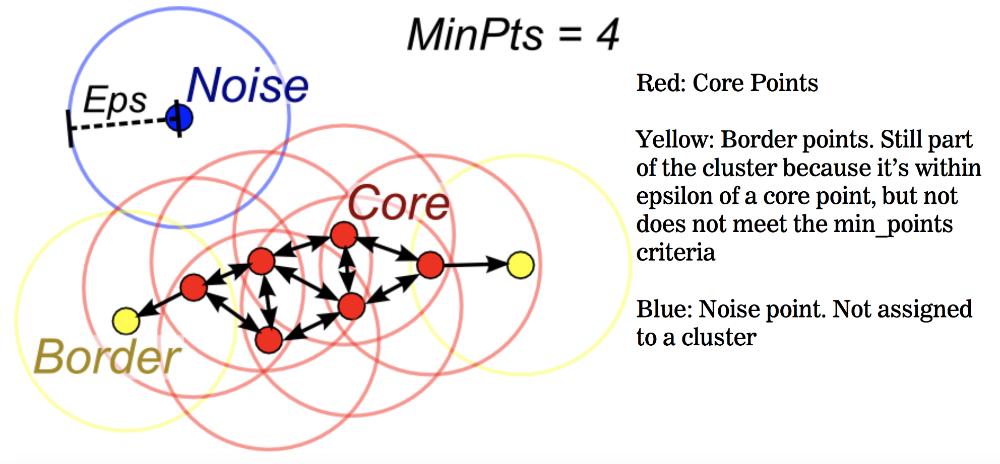
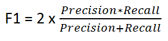

# Anomaly Detection on Machine Failures Based on 4 different Bearings.
## Introduction
In this repository, I am going to analyse the Anomaly Detection based on Time-Series Model on Machine Failures with 4 different bearings. I am using DBSCAN (Density-Based Spatial Clustering of Applications with noise) to
identify the anomaly detection. The basic concept of DBSCAN is to group together the closest dataset value, where the outliers are lied alone
in this method. The method to group the associate datasets is identified using **Epsilon** and **Minimum Points** which defines the radius of grouping.

## DB-SCAN
DB-SCAN is an unsupervised learning method that aims to separate the High-Density of the associate dataset values with the Low-Density one. The Low-Density may refers to the Outliers. The DBSCAN steps are:
- Clustering the dataset into *n* dimensions.
- In each point in this dimensions, DBSCAN creates a circle shape based on the epsilon, which denotes the radius of the circle. This circle implies in each *n* point for each dataset.
- DBSCAN will do this iteratively, and afterwards, the DBSCAN able to trace which dataset is lied alone and not.

The following picture illustrates the DB-SCAN method : 

References : 
https://medium.com/@elutins/dbscan-what-is-it-when-to-use-it-how-to-use-it-8bd506293818

The fascinating question is how to decide the optimum number of epsilon in this method. I found a related work to this method.
The algorithm to find the optimum number of the epsilon is calculating the distance to the closest *n* numbers, filter it, and calculate the 3 nearest distance. This algorithm is based on the following paper. [References-DBSCAN](References/Determination_of_Optimal_Epsilon_Value_on_DBSCAN_Algorithm.pdf)

## Evaluation 
To evaluate the results from the DB-SCAN, I am using the Statistical Approach to identify the anomaly detection.
. Based on paper as follows, the closest *mean* and *2 * standard dev*. Therefore, we able to trace the normal behaviour of the dataset with following formula : 

                                          Mean - 2 * Std <X < Mean + 2 * Std

## Results
By evaluating the DB-SCAN method, there are several parameters are used to test this, which are Accuracy, Precision, Recall, and F1 Score. Of course, Accuracy, which is based on the calculation of **True Negative** and **True Positive**, seems to be implementable to be used. However, by considering the fact of how many Normal behavior here is actually the one who got anomalies, and should be taken out in this measurement. This is where Precision and Recall are needed for this calculation.
Here are the description of the parameter calculation as follows : 

Precision and Recall

F1 Score

The results obtained after testing the Evaluation Standard of Statistical Approach with the DBSCAN is as follows :  
- Accuracy : 98.9%
- Precision : 99.4%
- Recall : 85.2%
- F1 Score : 91.1%
